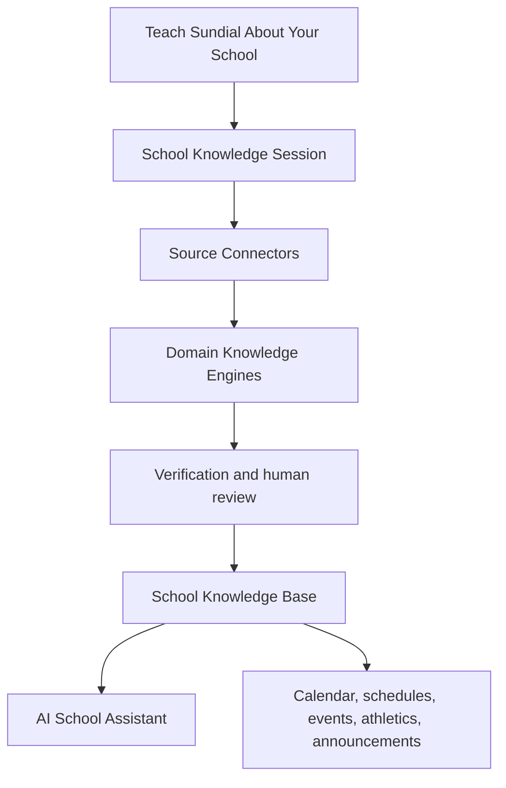

# Vision

# Purpose

Describe the long-term outcome: **Teach Sundial About Your School** without making schools recreate information they already maintain.

---

# Responsibilities

Set direction for AI School Builder, School Knowledge Sessions, the School Knowledge Base, Knowledge Engines, Source Connectors, verification, and the AI School Assistant.

---

# Architecture

AI School Builder is the guided product experience. A School Knowledge Session is the bounded, auditable unit of work. Connectors acquire source material; Knowledge Engines propose domain objects; verification and human review decide what may enter the reusable School Knowledge Base. The assistant consumes approved knowledge rather than raw uploads.

## Current Implementation

Advanced AI Calendar Import supplies an early workspace/rendering foundation and the existing calendar workflow supplies domain-specific analysis and review. They do not yet implement this full model.

## Future Vision

Knowledge should be provenance-rich, tenant-isolated, reviewable, reusable, and refreshable when sources change.

---

# Data Model

The vision requires sessions, artifacts, proposed and approved knowledge objects, provenance, verification results, and review decisions. Exact schemas beyond current import-session tables are TODO.

---

# Processing Pipeline

Acquire → normalize/render → classify → extract → build → verify → review → publish → reuse.

---

# Public Interfaces

School administrators need guided source submission and review. Sundial products need a stable, tenant-scoped read interface for approved knowledge. Exact contracts are TODO.

---

# Internal Components

Connectors, render workers, engines, verification services, review tooling, and provenance storage must remain replaceable behind explicit contracts.

---

# Future Enhancements

Continuous source refresh, cross-source reconciliation, correction learning, and conversational school assistance.

---

# Open Questions

- TODO: define publication and expiration semantics for approved knowledge.
- TODO: define which decisions always require a human.

---

# Testing Strategy

Measure trustworthiness, provenance completeness, tenant isolation, reproducibility, and safe failure—not extraction accuracy alone.

---

# Notes

The assistant is a consumer of governed knowledge, not a bypass around verification.

## Related documents

- [Product Philosophy](01-product-philosophy.md)
- [System Overview](architecture/system-overview.md)
- [Glossary](architecture/glossary.md)
