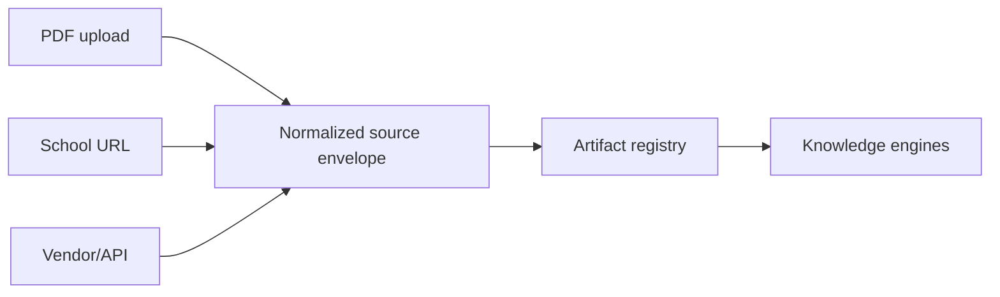

# Source Connector Framework

# Purpose

Define interchangeable acquisition adapters for school-controlled information sources.

---

# Responsibilities

Authenticate where required, fetch within declared scope, preserve source identity, and emit normalized artifacts plus acquisition metadata.

---

# Architecture

## Current Implementation

Direct browser PDF upload is the only concrete source path in the advanced importer. A general connector interface does not exist.

## Future Vision

---

# Data Model

TODO: connector definition, connection/credential reference, source locator, fetch attempt, content version, and normalized source envelope.

---

# Processing Pipeline

Discover/configure → authorize → acquire → fingerprint → register artifacts → report warnings/failure. Rendering is downstream, not a connector responsibility.

---

# Public Interfaces

TODO: `SourceConnector` contract, capability declaration, acquisition request/result, pagination/rate-limit semantics.

---

# Internal Components

Credential broker, connector registry, fetch policy, content-type detector, artifact registry.

---

# Future Enhancements

Web pages, calendars/feeds, storage providers, SIS/vendor APIs, and scheduled refresh.

---

# Open Questions

- Which connector types may run unattended?
- How are credentials stored, rotated, and revoked?

---

# Testing Strategy

Shared conformance suite plus adapter-specific auth, pagination, rate-limit, change-detection, and redaction tests.

---

# Notes

Connectors acquire evidence; they do not decide school truth.

## Related documents

- [Connector Lifecycle](architecture/connector-lifecycle.md)
- [Artifact Lifecycle](architecture/artifact-lifecycle.md)
- [Source Conflict Resolution](16-source-priority-conflict-resolution.md)
