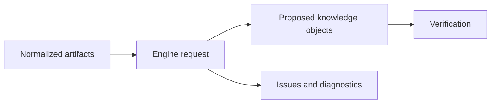

# Knowledge Engine API

# Purpose

Specify the shared boundary through which domain engines convert evidence into proposed knowledge.

---

# Responsibilities

Version inputs/outputs; carry provenance, confidence, issues, and diagnostics; isolate domain logic from connectors and storage.

---

# Architecture

## Current Implementation

No shared Knowledge Engine API exists. Calendar analysis has calendar-specific schemas and routes.

## Future Vision

---

# Data Model

TODO: engine descriptor/version, run, input artifact references, proposed objects, provenance spans, confidence dimensions, issue codes, and output digest.

---

# Processing Pipeline

Eligibility → classify → extract → normalize → build proposals → self-check → return immutable result.

---

# Public Interfaces

TODO: exact request/response types, execution/cancellation protocol, error taxonomy, and compatibility policy.

---

# Internal Components

Engine registry, domain schemas, model/provider adapter, deterministic validators, provenance builder.

---

# Future Enhancements

Multiple engine versions, evaluation routing, deterministic replays, and provider substitution.

---

# Open Questions

- Is execution synchronous, queued, or both?
- How are partial results represented without implying publication?

---

# Testing Strategy

Shared contract suite plus engine-specific corpora, schema validation, provenance checks, deterministic validators, and backward compatibility fixtures.

---

# Notes

Confidence is metadata for review and policy; it is not proof.

## Related documents

- [Knowledge Pipeline](architecture/knowledge-pipeline.md)
- [Verification Engine](13-verification-engine.md)
- [Glossary](architecture/glossary.md)
