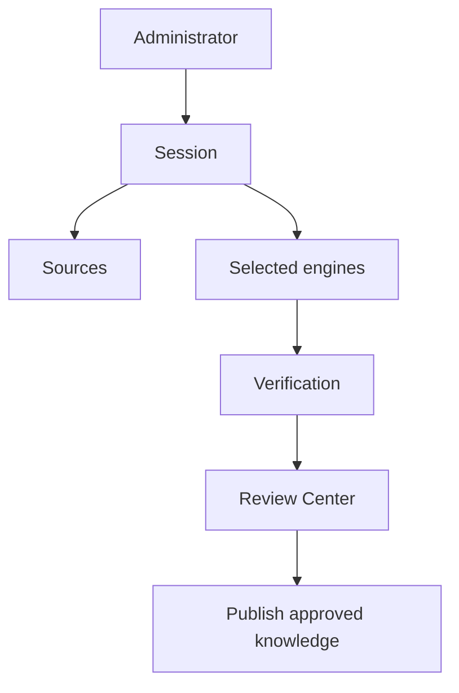

# School Knowledge Builder

# Purpose

Define the orchestration layer and guided experience that turns one or more sources into proposed, reviewed school knowledge.

---

# Responsibilities

Create sessions, collect sources, select engines, show progress, aggregate review, and publish approved outcomes through domain adapters.

---

# Architecture

## Current Implementation

The advanced calendar wizard/provider is an experimental shell around workspace preparation and compatibility routes. A cross-domain School Knowledge Builder does not exist.

## Future Vision

---

# Data Model

TODO: builder plan, selected sources/engines, progress summary, review readiness, publication transaction/result.

---

# Processing Pipeline

Plan → acquire → prepare → execute engines → verify → review → publish → summarize.

---

# Public Interfaces

TODO: orchestration commands, progress events, cancellation/resume, and publication result.

---

# Internal Components

Session service, connector registry, engine registry, pipeline coordinator, verification, review, publication adapters.

---

# Future Enhancements

Recommended sources, multi-session continuation, scheduled refresh plans, and impact previews.

---

# Open Questions

- What is the atomic publication boundary across domains?
- How should partial success be presented and resumed?

---

# Testing Strategy

End-to-end fixtures, failure injection per stage, resume/idempotency, tenant permissions, and partial-publication safeguards.

---

# Notes

The Builder orchestrates; it should not absorb connector or domain-engine logic.

## Related documents

- [School Knowledge Session](03-school-knowledge-session.md)
- [Knowledge Pipeline](architecture/knowledge-pipeline.md)
- [Review Center](14-knowledge-review-center.md)
