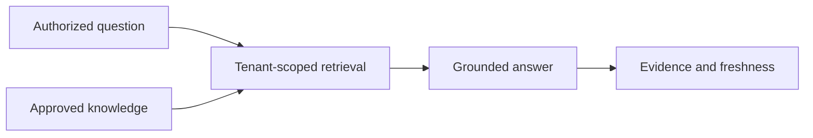

# AI School Assistant

# Purpose

Define a future conversational interface grounded in approved, tenant-scoped School Knowledge.

---

# Responsibilities

Retrieve authorized knowledge, answer with provenance, state uncertainty/freshness, and invoke only explicitly permitted actions.

---

# Architecture

## Current Implementation

No AI School Assistant using a School Knowledge Base exists.

## Future Vision

---

# Data Model

TODO: conversation/retention policy, retrieval record, cited knowledge versions, answer, uncertainty, requested/approved action.

---

# Processing Pipeline

Authorize → interpret → retrieve approved knowledge → compose → verify grounding → answer/cite → optionally request action confirmation.

---

# Public Interfaces

TODO: chat/query contract, citations, feedback, and explicit action-confirmation protocol.

---

# Internal Components

Authorization, retriever, policy layer, response generator, grounding checker, action broker, audit.

---

# Future Enhancements

Role-aware help, multilingual answers, proactive freshness notices, and carefully scoped administrative actions.

---

# Open Questions

- Which roles can access which knowledge categories?
- What retention and student/privacy policies apply?

---

# Testing Strategy

Tenant leakage, permission changes, stale/unapproved knowledge exclusion, citation correctness, prompt injection, uncertainty, and action confirmation.

---

# Notes

The assistant must not treat raw artifacts or rejected proposals as school truth.

## Related documents

- [Vision](00-vision.md)
- [School Knowledge Builder](12-school-knowledge-builder.md)
- [Glossary](architecture/glossary.md)
