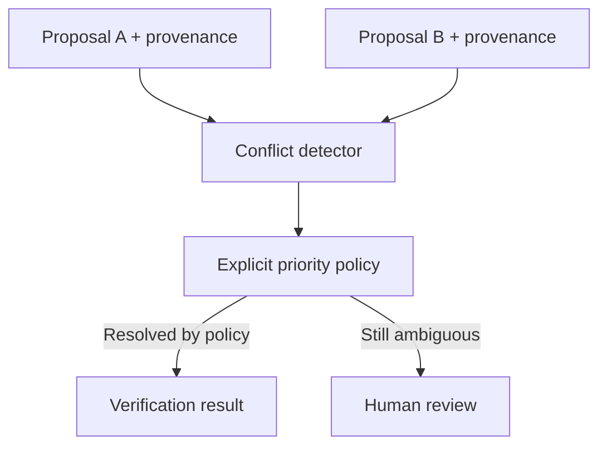

# Source Priority and Conflict Resolution

# Purpose

Define how competing evidence is identified, ranked, explained, and resolved without hiding disagreement.

---

# Responsibilities

Preserve all relevant evidence, distinguish source authority from extraction confidence, apply explicit policy, and route unresolved conflict to review.

---

# Architecture

## Current Implementation

Calendar-specific merging and validation exist; no general source-priority policy exists.

## Future Vision

---

# Data Model

TODO: source authority policy, scope, effective dates, conflict group, competing claims, resolution, rationale, actor/rule version.

---

# Processing Pipeline

Match claims → detect disagreement → evaluate freshness/authority/specificity → resolve or escalate → preserve rationale.

---

# Public Interfaces

TODO: policy configuration, conflict result, reviewer decision, and re-evaluation contract.

---

# Internal Components

Claim matcher, freshness evaluator, authority policy, conflict grouper, review adapter.

---

# Future Enhancements

Domain-specific authority matrices and historical reliability signals, subject to governance review.

---

# Open Questions

- Who may configure source authority, and at what scope?
- When does freshness outweigh formally higher authority?

---

# Testing Strategy

Agreement, stale authority, equal authority, partial overlap, policy-version change, and manual override fixtures.

---

# Notes

A confidence score must never be used as an undocumented source-priority rule.

## Related documents

- [Verification Engine](13-verification-engine.md)
- [Review Center](14-knowledge-review-center.md)
- [Connector Framework](04-source-connector-framework.md)
