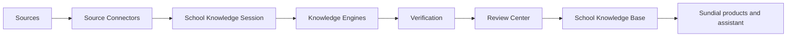

# AI School Builder Engineering Library

# Purpose

Define the canonical technical source of truth for **AI School Builder**: Sundial's long-term system for learning a school's existing knowledge, verifying it with people, and reusing it across Sundial.

---

# Responsibilities

- Explain both the reasons behind decisions and the resulting contracts.
- Separate [current implementation](#current-implementation) from future vision.
- Keep terminology consistent with the [glossary](architecture/glossary.md).
- Record unknowns as `TODO`, never as assumed behavior.

---

# Architecture

Start with [Vision](00-vision.md), [Product Philosophy](01-product-philosophy.md), and the [Master Roadmap](02-master-roadmap.md). Then read [System Overview](architecture/system-overview.md), [Data Flow](architecture/data-flow.md), and the component document relevant to the change.

## Current Implementation

The repository contains an experimental advanced AI calendar-import foundation: import sessions, artifact storage, PDF page rendering, diagnostics, ordered pipeline stages, and compatibility delegation to the production AI Calendar Import. It is not yet a general School Knowledge Base.

## Future Vision

The remaining documents describe intended boundaries and unresolved design work. A future label is not an implementation commitment until its roadmap phase and interfaces are approved.

---

# Data Model

See [School Knowledge Session](03-school-knowledge-session.md) and [Artifact Lifecycle](architecture/artifact-lifecycle.md). Canonical knowledge-object persistence is `TODO`.

---

# Processing Pipeline

See [Knowledge Pipeline](architecture/knowledge-pipeline.md) and [Rendering Pipeline](architecture/rendering-pipeline.md).

---

# Public Interfaces

Proposed service boundaries are documented in [Knowledge Engine API](06-knowledge-engine-api.md). They are not stable public APIs yet.

---

# Internal Components

Numbered files own product/component specifications; `architecture/` owns cross-component flows and vocabulary. When code and documentation disagree, treat that as a defect: verify the code, then update both in the same change.

---

# Future Enhancements

See [Future Roadmap](18-future-roadmap.md).

---

# Open Questions

- TODO: choose the formal decision-record process and owner.
- TODO: define documentation review requirements for cross-component changes.

---

# Testing Strategy

Documentation changes must pass link/diagram review and be checked against code, migrations, and tests. See [Testing Strategy](17-testing-strategy.md).

---

# Notes

Every file uses this common section template. Empty design areas remain explicit TODOs.

## Related documents

- [Vision](00-vision.md)
- [Master Roadmap](02-master-roadmap.md)
- [Glossary](architecture/glossary.md)
