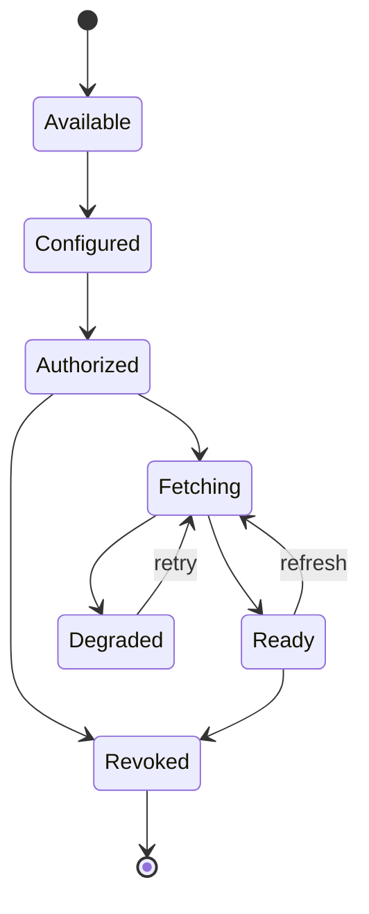

# Connector Lifecycle

# Purpose

Define the future lifecycle of a source connector from discovery through revocation.

---

# Responsibilities

Describe configuration, authorization, acquisition, refresh, error handling, observability, and retirement.

---

# Architecture

## Current Implementation

No general connector lifecycle exists; direct PDF upload is request-scoped and requires no stored external authorization.

## Future Vision

Connection state is separate from individual fetch attempts and source-content versions.

---

# Data Model

TODO: connector type/version, configuration, secret reference, grants/scopes, connection status, fetch attempt, cursor, source version, error.

---

# Processing Pipeline

Install/enable → configure → authorize → test → fetch → register → refresh → revoke/retire.

---

# Public Interfaces

TODO: connector manifest, authorization callbacks, fetch/refresh, health, revoke.

---

# Internal Components

Registry, credential broker, scheduler, rate limiter, fetch runner, health/diagnostics.

---

# Future Enhancements

Incremental sync, webhooks, shared vendor adapters with school-specific credentials.

---

# Open Questions

- How are connector upgrades rolled back?
- How long may cached credentials/results remain usable?

---

# Testing Strategy

State transitions, OAuth/token expiry, revocation, rate limits, pagination, retries, upgrade compatibility, and tenant isolation.

---

# Notes

Revoking a connector must not silently erase previously approved knowledge.

## Related documents

- [Connector Framework](../04-source-connector-framework.md)
- [Artifact Lifecycle](artifact-lifecycle.md)
- [Future Roadmap](../18-future-roadmap.md)
