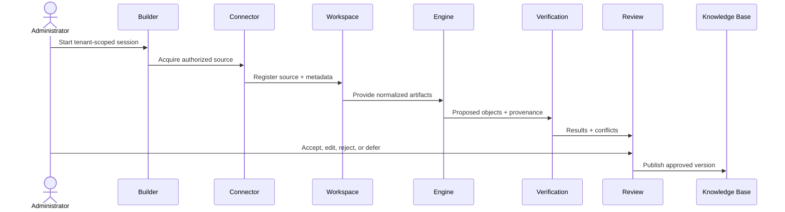

# Data Flow

# Purpose

Trace source bytes, derived artifacts, proposed claims, review decisions, and approved knowledge.

---

# Responsibilities

Make transformations, persisted boundaries, tenant scope, and trust transitions explicit.

---

# Architecture

## Current Implementation

PDF upload → source artifact → rendered page artifacts/metadata/diagnostics is implemented in the advanced importer. The proxy then uses existing calendar import analysis/result behavior; generalized proposal/publication flow is not implemented.

## Future Vision

Every derived datum can be traced to source artifact/version and transformation version.

---

# Data Model

Source and derived artifact checksums exist currently. Claim-level lineage and approved knowledge versions are TODO.

---

# Processing Pipeline

Data moves from untrusted source to derived evidence to proposed knowledge to human-governed approved knowledge.

---

# Public Interfaces

Only authorized tenant operations may initiate, inspect, review, or consume this flow.

---

# Internal Components

Artifact registry, renderer, engines, provenance builder, verification, decision audit, publication adapter.

---

# Future Enhancements

Change feeds and re-verification while preserving historical versions.

---

# Open Questions

- TODO: define deletion propagation and legal retention.

---

# Testing Strategy

Lineage completeness, checksum, cross-tenant denial, unapproved-object exclusion, and deletion/retention tests.

---

# Notes

Raw source availability does not grant every product permission to read it.

## Related documents

- [Artifact Lifecycle](artifact-lifecycle.md)
- [System Overview](system-overview.md)
- [Review Center](../14-knowledge-review-center.md)
