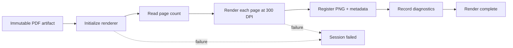

# Rendering Pipeline

# Purpose

Describe document-to-page transformation and its operational guarantees.

---

# Responsibilities

Specify inputs, stages, outputs, diagnostics, failure behavior, and future worker boundary.

---

# Architecture

## Current Implementation

Rendering is synchronous and sequential inside session preparation. The runtime records renderer steps, elapsed time, environment details, and exceptions. No pages are intentionally skipped.

## Future Vision

Dedicated execution, backpressure, bounded concurrency, cancellation, and fallback are TODO and must preserve artifact contracts.

---

# Data Model

See [Artifact Lifecycle](artifact-lifecycle.md) and [Render Worker](../05-render-worker.md).

---

# Processing Pipeline

The session transitions `uploaded` → `rendering_pages` → `render_complete`, or to `failed` on error.

---

# Public Interfaces

Internal PDF-byte input, rendered page/metadata output, diagnostic observer.

---

# Internal Components

`DocumentRendererService`, `ArtifactRegistryService`, `DiagnosticsService`, `PipelineStateService`.

---

# Future Enhancements

OCR, text-layer extraction, preview variants, worker queues, resource budgets.

---

# Open Questions

- TODO: set explicit upload/page/pixel/time/memory limits.

---

# Testing Strategy

Renderer contract fixtures and deployment-runtime tests are required; local success is insufficient for native rendering dependencies.

---

# Notes

The 300-DPI value is current behavior, not a universal future requirement.

## Related documents

- [Render Worker](../05-render-worker.md)
- [Artifact Lifecycle](artifact-lifecycle.md)
- [Testing Strategy](../17-testing-strategy.md)
