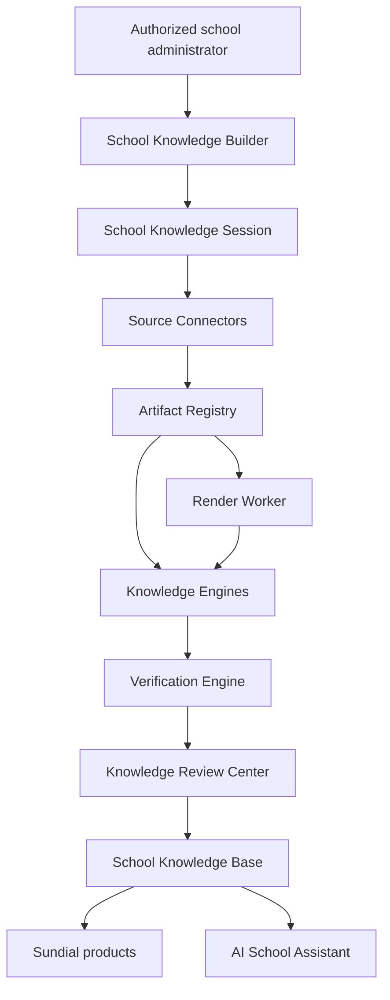

# System Overview

# Purpose

Show AI School Builder's intended component boundaries and the current implementation seam.

---

# Responsibilities

Describe ownership, interactions, trust boundaries, and publication flow.

---

# Architecture

## Current Implementation

The advanced importer implements a session/artifact/render/diagnostic slice and delegates through compatibility proxies to production calendar routes. The generalized connectors, engines, verification, Review Center, Knowledge Base, and assistant are future.

## Future Vision

Each boundary is versioned and tenant-scoped; raw artifacts cannot become approved knowledge without verification/review policy.

---

# Data Model

Current session/workspace tables exist. Proposed engine, verification, review, and knowledge schemas are TODO.

---

# Processing Pipeline

See [Knowledge Pipeline](knowledge-pipeline.md) and [Data Flow](data-flow.md).

---

# Public Interfaces

Browser-facing builder/review surfaces and tenant-scoped knowledge reads; exact future contracts are TODO.

---

# Internal Components

Connector/engine registries, storage, worker execution, verification policies, publication adapters, observability.

---

# Future Enhancements

Queue-based workers, continuous refresh, and multiple knowledge consumers.

---

# Open Questions

- Where are worker trust/runtime boundaries deployed?
- Is publication coordinated centrally or by domain adapters?

---

# Testing Strategy

Boundary contract, tenant authorization, lifecycle, failure isolation, and end-to-end publication tests.

---

# Notes

Arrows show permitted information flow, not current deployment topology.

## Related documents

- [Data Flow](data-flow.md)
- [Knowledge Pipeline](knowledge-pipeline.md)
- [Master Roadmap](../02-master-roadmap.md)
